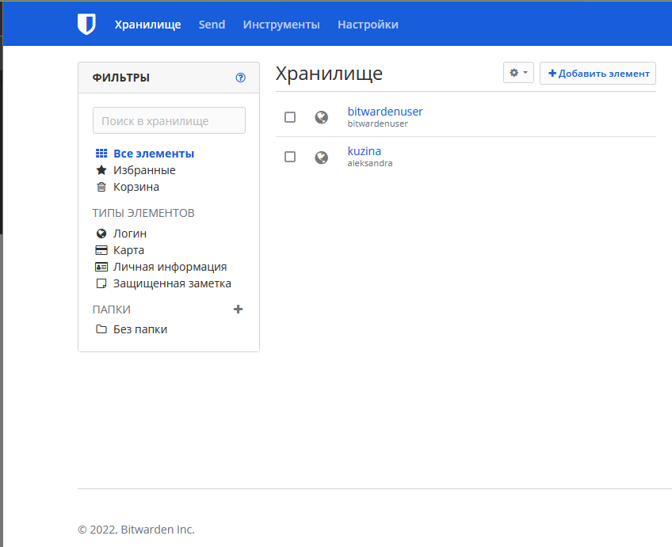
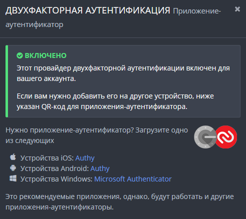
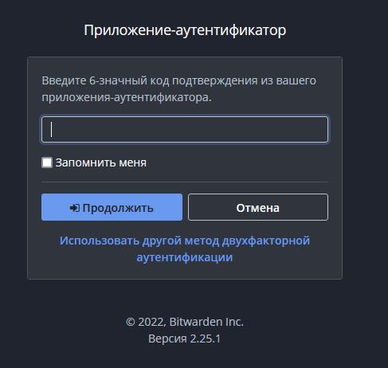
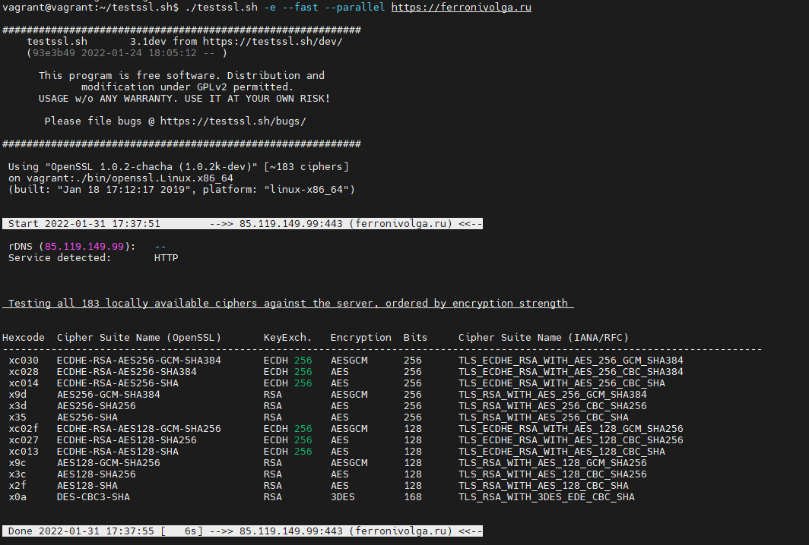
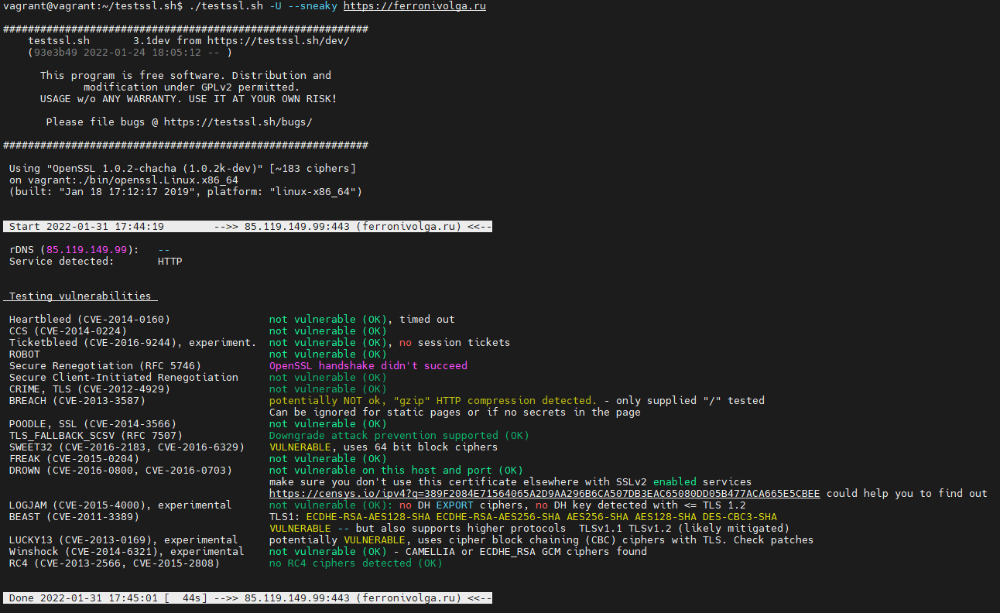

### 1. Установите Bitwarden плагин для браузера. Зарегестрируйтесь и сохраните несколько паролей.

*Bitwarden установила, достаточно удобно! Но чаще пользуюсь keepass*




### 2. Установите Google authenticator на мобильный телефон. Настройте вход в Bitwarden акаунт через Google authenticator OTP
*Google authenticator установлен код генерируется каждые 30 секунд, вход с помощью двухфакторной аутентификации выполнен  (ввод пароля + код OTP)*




### 3. Установите apache2, сгенерируйте самоподписанный сертификат, настройте тестовый сайт для работы по HTTPS.

```
 sudo systemctl status apache2
● apache2.service - The Apache HTTP Server
   Loaded: loaded (/lib/systemd/system/apache2.service; enabled; vendor preset: enabled)
   Active: active (running) since Thu 2022-01-27 14:04:35 MSK; 4min 21s ago
     Docs: https://httpd.apache.org/docs/2.4/
  Process: 8836 ExecStart=/usr/sbin/apachectl start (code=exited, status=0/SUCCESS)
 Main PID: 8840 (apache2)
    Tasks: 55 (limit: 4915)
   Memory: 8.7M
   CGroup: /system.slice/apache2.service
           ├─8840 /usr/sbin/apache2 -k start
           ├─8841 /usr/sbin/apache2 -k start
           └─8842 /usr/sbin/apache2 -k start

Jan 27 14:04:35 debian systemd[1]: Starting The Apache HTTP Server...
Jan 27 14:04:35 debian systemd[1]: Started The Apache HTTP Server.
```


````
/# sudo openssl req -x509 -nodes -days 365 -newkey rsa:2048 -keyout /etc/apache2/ssl/apache_for_example_com_netology.key -out /etc/apache2/ssl/apache_for_example_com_netology.crt
Generating a RSA private key
.........................................................+++++
...............................................................................+++++
writing new private key to '/etc/apache2/ssl/apache_for_example_com_netology.key'
-----
You are about to be asked to enter information that will be incorporated
into your certificate request.
What you are about to enter is what is called a Distinguished Name or a DN.
There are quite a few fields but you can leave some blank
For some fields there will be a default value,
If you enter '.', the field will be left blank.
-----
Country Name (2 letter code) [AU]:netology
string is too long, it needs to be no more than 2 bytes long
Country Name (2 letter code) [AU]:moskow
string is too long, it needs to be no more than 2 bytes long
Country Name (2 letter code) [AU]:Moskow
string is too long, it needs to be no more than 2 bytes long
Country Name (2 letter code) [AU]:RU
State or Province Name (full name) [Some-State]:Moskow
Locality Name (eg, city) []:Netology
Organization Name (eg, company) [Internet Widgits Pty Ltd]:Netology
Organizational Unit Name (eg, section) []:DevSys_DPC_2
Common Name (e.g. server FQDN or YOUR name) []:DevSys_DPC_2_KUZINA
Email Address []:example.com
````

### 4. Проверьте на TLS уязвимости произвольный сайт в интернете (кроме сайтов МВД, ФСБ, МинОбр, НацБанк, РосКосмос, РосАтом, РосНАНО и любых госкомпаний, объектов КИИ, ВПК ... и тому подобное).




### 5. Установите на Ubuntu ssh сервер, сгенерируйте новый приватный ключ. Скопируйте свой публичный ключ на другой сервер. Подключитесь к серверу по SSH-ключу.

*Пытаемся зайти на сервер по ssh*
```
C:\Users\A\.ssh>ssh root@127.0.0.1 -p 2222
root@127.0.0.1's password:
```

*добавляем публичный ключ windows в ubuntu и  успешно заходим:*

```
root@vagrant:~/.ssh# echo "ssh-rsa public-key" >> ~/.ssh/authorized_keys

C:\Users\A\.ssh>ssh root@127.0.0.1 -p 2222
Welcome to Ubuntu 20.04.2 LTS (GNU/Linux 5.4.0-80-generic x86_64)

 * Documentation:  https://help.ubuntu.com
 * Management:     https://landscape.canonical.com
 * Support:        https://ubuntu.com/advantage

  System information as of Mon 31 Jan 2022 06:41:34 PM UTC

This system is built by the Bento project by Chef Software
More information can be found at https://github.com/chef/bento
Last login: Mon Jan 31 18:36:01 2022 from 10.0.2.2
root@vagrant:~#
```

### 6. Переименуйте файлы ключей из задания 5. Настройте файл конфигурации SSH клиента, так чтобы вход на удаленный сервер осуществлялся по имени сервера.

*Чтобы вход на удаленный сервер осуществлялся по имени сервера, добавим конфигурационный файл ssh* 

```
C:\Users\A\.ssh
Host ubuntu
  HostName 127.0.0.1
  IdentityFile ~/.ssh/prkey
  User root
  Port 2222
  #StrictHostKeyChecking no
```
```
root@vagrant:~/.ssh# echo "ssh-rsa publik-key" >> known_hosts
```
*Захоим по ssh windows в ubuntu*

```
C:\Users\A\.ssh>ssh ubuntu
Load key "C:\\Users\\A/.ssh/prkey": invalid format
Welcome to Ubuntu 20.04.2 LTS (GNU/Linux 5.4.0-80-generic x86_64)

 * Documentation:  https://help.ubuntu.com
 * Management:     https://landscape.canonical.com
 * Support:        https://ubuntu.com/advantage

  System information as of Mon 31 Jan 2022 07:29:41 PM UTC

This system is built by the Bento project by Chef Software
More information can be found at https://github.com/chef/bento
Last login: Mon Jan 31 19:25:53 2022 from 10.0.2.2
```

### 7. Соберите дамп трафика утилитой tcpdump в формате pcap, 100 пакетов. Откройте файл pcap в Wireshark.

* собираем 100 файлов в формате pcap *
```
root@debian11:/# tcpdump -c 100 -i enp0s8
tcpdump: verbose output suppressed, use -v[v]... for full protocol decode
listening on enp0s8, link-type EN10MB (Ethernet), snapshot length 262144 bytes
23:10:36.565015 IP debian11.ssh > 192.168.56.1.55020: Flags [P.], seq 4084083007:4084083055, ack 4130417583, win 501, length 48
23:10:36.565119 IP debian11.ssh > 192.168.56.1.55020: Flags [P.], seq 48:144, ack 1, win 501, length 96
23:10:36.565217 IP 192.168.56.1.55020 > debian11.ssh: Flags [.], ack 48, win 8192, length 0
23:10:36.565265 IP debian11.ssh > 192.168.56.1.55020: Flags [P.], seq 144:192, ack 1, win 501, length 48
23:10:36.565357 IP debian11.ssh > 192.168.56.1.55020: Flags [P.], seq 192:288, ack 1, win 501, length 96
23:10:36.565457 IP 192.168.56.1.55020 > debian11.ssh: Flags [.], ack 192, win 8192, length 0
23:10:36.605735 IP 192.168.56.1.55020 > debian11.ssh: Flags [.], ack 288, win 8191, length 0
23:10:36.684524 IP debian11.ssh > 192.168.56.1.55020: Flags [P.], seq 288:432, ack 1, win 501, length 144
23:10:36.684998 IP debian11.ssh > 192.168.56.1.55020: Flags [P.], seq 432:480, ack 1, win 501, length 48
23:10:36.685364 IP 192.168.56.1.55020 > debian11.ssh: Flags [.], ack 480, win 8190, length 0
23:10:36.685414 IP debian11.ssh > 192.168.56.1.55020: Flags [P.], seq 480:560, ack 1, win 501, length 80
23:10:36.685790 IP debian11.ssh > 192.168.56.1.55020: Flags [P.], seq 560:608, ack 1, win 501, length 48
23:10:36.686019 IP debian11.ssh > 192.168.56.1.55020: Flags [P.], seq 608:688, ack 1, win 501, length 80
23:10:36.686214 IP 192.168.56.1.55020 > debian11.ssh: Flags [.], ack 608, win 8190, length 0
23:10:36.686358 IP debian11.ssh > 192.168.56.1.55020: Flags [P.], seq 688:736, ack 1, win 501, length 48
23:10:36.686583 IP debian11.ssh > 192.168.56.1.55020: Flags [P.], seq 736:800, ack 1, win 501, length 64
23:10:36.686705 IP 192.168.56.1.55020 > debian11.ssh: Flags [.], ack 736, win 8189, length 0
23:10:36.687037 IP debian11.ssh > 192.168.56.1.55020: Flags [P.], seq 800:848, ack 1, win 501, length 48
23:10:36.687255 IP debian11.ssh > 192.168.56.1.55020: Flags [P.], seq 848:912, ack 1, win 501, length 64
23:10:36.687486 IP 192.168.56.1.55020 > debian11.ssh: Flags [.], ack 848, win 8195, length 0
23:10:36.687586 IP debian11.ssh > 192.168.56.1.55020: Flags [P.], seq 912:960, ack 1, win 501, length 48
23:10:36.687990 IP 192.168.56.1.55020 > debian11.ssh: Flags [.], ack 960, win 8194, length 0
23:10:36.688185 IP debian11.ssh > 192.168.56.1.55020: Flags [P.], seq 960:1024, ack 1, win 501, length 64
23:10:36.688569 IP debian11.ssh > 192.168.56.1.55020: Flags [P.], seq 1024:1072, ack 1, win 501, length 48
23:10:36.688701 IP debian11.ssh > 192.168.56.1.55020: Flags [P.], seq 1072:1136, ack 1, win 501, length 64
23:10:36.689003 IP 192.168.56.1.55020 > debian11.ssh: Flags [.], ack 1072, win 8194, length 0
23:10:36.689334 IP debian11.ssh > 192.168.56.1.55020: Flags [P.], seq 1136:1184, ack 1, win 501, length 48
23:10:36.689814 IP 192.168.56.1.55020 > debian11.ssh: Flags [.], ack 1184, win 8194, length 0
23:10:36.767793 IP debian11.ssh > 192.168.56.1.55020: Flags [P.], seq 1184:1264, ack 1, win 501, length 80
23:10:36.767888 IP debian11.ssh > 192.168.56.1.55020: Flags [P.], seq 1264:1376, ack 1, win 501, length 112
23:10:36.767975 IP debian11.ssh > 192.168.56.1.55020: Flags [P.], seq 1376:1424, ack 1, win 501, length 48
23:10:36.768015 IP 192.168.56.1.55020 > debian11.ssh: Flags [.], ack 1376, win 8193, length 0
23:10:36.768126 IP debian11.ssh > 192.168.56.1.55020: Flags [P.], seq 1424:1488, ack 1, win 501, length 64
23:10:36.768203 IP debian11.ssh > 192.168.56.1.55020: Flags [P.], seq 1488:1600, ack 1, win 501, length 112
23:10:36.768287 IP 192.168.56.1.55020 > debian11.ssh: Flags [.], ack 1488, win 8192, length 0
23:10:36.768321 IP debian11.ssh > 192.168.56.1.55020: Flags [P.], seq 1600:1648, ack 1, win 501, length 48
23:10:36.768376 IP debian11.ssh > 192.168.56.1.55020: Flags [P.], seq 1648:1712, ack 1, win 501, length 64
23:10:36.768454 IP debian11.ssh > 192.168.56.1.55020: Flags [P.], seq 1712:1760, ack 1, win 501, length 48
23:10:36.768508 IP debian11.ssh > 192.168.56.1.55020: Flags [P.], seq 1760:1824, ack 1, win 501, length 64
23:10:36.768568 IP 192.168.56.1.55020 > debian11.ssh: Flags [.], ack 1648, win 8192, length 0
23:10:36.768591 IP debian11.ssh > 192.168.56.1.55020: Flags [P.], seq 1824:1872, ack 1, win 501, length 48
23:10:36.768644 IP debian11.ssh > 192.168.56.1.55020: Flags [P.], seq 1872:1936, ack 1, win 501, length 64
23:10:36.768714 IP 192.168.56.1.55020 > debian11.ssh: Flags [.], ack 1760, win 8191, length 0
23:10:36.768719 IP debian11.ssh > 192.168.56.1.55020: Flags [P.], seq 1936:1984, ack 1, win 501, length 48
23:10:36.768778 IP debian11.ssh > 192.168.56.1.55020: Flags [P.], seq 1984:2048, ack 1, win 501, length 64
23:10:36.768843 IP 192.168.56.1.55020 > debian11.ssh: Flags [.], ack 1872, win 8191, length 0
23:10:36.768848 IP debian11.ssh > 192.168.56.1.55020: Flags [P.], seq 2048:2096, ack 1, win 501, length 48
23:10:36.768910 IP debian11.ssh > 192.168.56.1.55020: Flags [P.], seq 2096:2160, ack 1, win 501, length 64
23:10:36.768980 IP 192.168.56.1.55020 > debian11.ssh: Flags [.], ack 1984, win 8190, length 0
23:10:36.768980 IP 192.168.56.1.55020 > debian11.ssh: Flags [.], ack 2096, win 8190, length 0
23:10:36.768986 IP debian11.ssh > 192.168.56.1.55020: Flags [P.], seq 2160:2208, ack 1, win 501, length 48
23:10:36.769046 IP debian11.ssh > 192.168.56.1.55020: Flags [P.], seq 2208:2272, ack 1, win 501, length 64
23:10:36.769146 IP 192.168.56.1.55020 > debian11.ssh: Flags [.], ack 2208, win 8190, length 0
23:10:36.769155 IP debian11.ssh > 192.168.56.1.55020: Flags [P.], seq 2272:2320, ack 1, win 501, length 48
23:10:36.769212 IP debian11.ssh > 192.168.56.1.55020: Flags [P.], seq 2320:2384, ack 1, win 501, length 64
23:10:36.769282 IP debian11.ssh > 192.168.56.1.55020: Flags [P.], seq 2384:2432, ack 1, win 501, length 48
23:10:36.769337 IP debian11.ssh > 192.168.56.1.55020: Flags [P.], seq 2432:2496, ack 1, win 501, length 64
23:10:36.769415 IP 192.168.56.1.55020 > debian11.ssh: Flags [.], ack 2320, win 8195, length 0
23:10:36.769416 IP 192.168.56.1.55020 > debian11.ssh: Flags [.], ack 2432, win 8194, length 0
23:10:36.769427 IP debian11.ssh > 192.168.56.1.55020: Flags [P.], seq 2496:2544, ack 1, win 501, length 48
23:10:36.769487 IP debian11.ssh > 192.168.56.1.55020: Flags [P.], seq 2544:2608, ack 1, win 501, length 64
23:10:36.769548 IP 192.168.56.1.55020 > debian11.ssh: Flags [.], ack 2544, win 8194, length 0
23:10:36.769571 IP debian11.ssh > 192.168.56.1.55020: Flags [P.], seq 2608:2656, ack 1, win 501, length 48
23:10:36.769625 IP debian11.ssh > 192.168.56.1.55020: Flags [P.], seq 2656:2720, ack 1, win 501, length 64
23:10:36.769691 IP 192.168.56.1.55020 > debian11.ssh: Flags [.], ack 2656, win 8194, length 0
23:10:36.769726 IP debian11.ssh > 192.168.56.1.55020: Flags [P.], seq 2720:2768, ack 1, win 501, length 48
23:10:36.769779 IP debian11.ssh > 192.168.56.1.55020: Flags [P.], seq 2768:2832, ack 1, win 501, length 64
23:10:36.769853 IP debian11.ssh > 192.168.56.1.55020: Flags [P.], seq 2832:2880, ack 1, win 501, length 48
23:10:36.769907 IP debian11.ssh > 192.168.56.1.55020: Flags [P.], seq 2880:2944, ack 1, win 501, length 64
23:10:36.769955 IP 192.168.56.1.55020 > debian11.ssh: Flags [.], ack 2768, win 8193, length 0
23:10:36.769956 IP 192.168.56.1.55020 > debian11.ssh: Flags [.], ack 2880, win 8193, length 0
23:10:36.769992 IP debian11.ssh > 192.168.56.1.55020: Flags [P.], seq 2944:2992, ack 1, win 501, length 48
23:10:36.770046 IP debian11.ssh > 192.168.56.1.55020: Flags [P.], seq 2992:3056, ack 1, win 501, length 64
23:10:36.770094 IP 192.168.56.1.55020 > debian11.ssh: Flags [.], ack 2992, win 8192, length 0
23:10:36.770129 IP debian11.ssh > 192.168.56.1.55020: Flags [P.], seq 3056:3104, ack 1, win 501, length 48
23:10:36.770205 IP 192.168.56.1.55020 > debian11.ssh: Flags [.], ack 3104, win 8192, length 0
23:10:36.770231 IP debian11.ssh > 192.168.56.1.55020: Flags [P.], seq 3104:3168, ack 1, win 501, length 64
23:10:36.770301 IP debian11.ssh > 192.168.56.1.55020: Flags [P.], seq 3168:3216, ack 1, win 501, length 48
23:10:36.770384 IP 192.168.56.1.55020 > debian11.ssh: Flags [.], ack 3216, win 8191, length 0
23:10:36.770411 IP debian11.ssh > 192.168.56.1.55020: Flags [P.], seq 3216:3280, ack 1, win 501, length 64
23:10:36.770485 IP debian11.ssh > 192.168.56.1.55020: Flags [P.], seq 3280:3328, ack 1, win 501, length 48
23:10:36.770560 IP 192.168.56.1.55020 > debian11.ssh: Flags [.], ack 3328, win 8191, length 0
23:10:36.770582 IP debian11.ssh > 192.168.56.1.55020: Flags [P.], seq 3328:3392, ack 1, win 501, length 64
23:10:36.770653 IP debian11.ssh > 192.168.56.1.55020: Flags [P.], seq 3392:3440, ack 1, win 501, length 48
23:10:36.770728 IP 192.168.56.1.55020 > debian11.ssh: Flags [.], ack 3440, win 8191, length 0
23:10:36.770751 IP debian11.ssh > 192.168.56.1.55020: Flags [P.], seq 3440:3504, ack 1, win 501, length 64
23:10:36.770844 IP debian11.ssh > 192.168.56.1.55020: Flags [P.], seq 3504:3552, ack 1, win 501, length 48
23:10:36.770962 IP 192.168.56.1.55020 > debian11.ssh: Flags [.], ack 3552, win 8190, length 0
23:10:36.871683 IP debian11.ssh > 192.168.56.1.55020: Flags [P.], seq 3552:3632, ack 1, win 501, length 80
23:10:36.871767 IP debian11.ssh > 192.168.56.1.55020: Flags [P.], seq 3632:3760, ack 1, win 501, length 128
23:10:36.871841 IP debian11.ssh > 192.168.56.1.55020: Flags [P.], seq 3760:3808, ack 1, win 501, length 48
23:10:36.871896 IP 192.168.56.1.55020 > debian11.ssh: Flags [.], ack 3760, win 8189, length 0
23:10:36.871982 IP debian11.ssh > 192.168.56.1.55020: Flags [P.], seq 3808:3872, ack 1, win 501, length 64
23:10:36.872139 IP 192.168.56.1.55020 > debian11.ssh: Flags [.], ack 3872, win 8195, length 0
23:10:36.872183 IP debian11.ssh > 192.168.56.1.55020: Flags [P.], seq 3872:4000, ack 1, win 501, length 128
23:10:36.872400 IP debian11.ssh > 192.168.56.1.55020: Flags [P.], seq 4000:4176, ack 1, win 501, length 176
23:10:36.872549 IP 192.168.56.1.55020 > debian11.ssh: Flags [.], ack 4176, win 8194, length 0
23:10:36.872592 IP debian11.ssh > 192.168.56.1.55020: Flags [P.], seq 4176:4304, ack 1, win 501, length 128
23:10:36.872699 IP 192.168.56.1.55020 > debian11.ssh: Flags [P.], seq 1:97, ack 4176, win 8194, length 96
23:10:36.872766 IP debian11.ssh > 192.168.56.1.55020: Flags [P.], seq 4304:4480, ack 97, win 501, length 176
100 packets captured
122 packets received by filter
0 packets dropped by kernel
```
*записываем в файл 0001.pcap, слишком долго почему-то происходила запись - записал всего 10 файлов, я прервала операцию, не совсем поняла, почему долго записывалось в файл*

```
root@debian11:/# tcpdump -w 0001.pcap -i enp0s8
tcpdump: listening on enp0s8, link-type EN10MB (Ethernet), snapshot length 262144 bytes
^C9 packets captured
10 packets received by filter
0 packets dropped by kernel

root@debian11:/# tcpdump -r 0001.pcap
reading from file 0001.pcap, link-type EN10MB (Ethernet), snapshot length 262144
23:17:43.521293 IP debian11.ssh > 192.168.56.1.55020: Flags [P.], seq 4084092783:4084092847, ack 4130421231, win 501, length 64
23:17:43.521412 IP debian11.ssh > 192.168.56.1.55020: Flags [P.], seq 64:208, ack 1, win 501, length 144
23:17:43.521509 IP 192.168.56.1.55020 > debian11.ssh: Flags [.], ack 64, win 8192, length 0
23:17:43.521570 IP debian11.ssh > 192.168.56.1.55020: Flags [P.], seq 208:288, ack 1, win 501, length 80
23:17:43.521726 IP debian11.ssh > 192.168.56.1.55020: Flags [P.], seq 288:352, ack 1, win 501, length 64
23:17:43.521778 IP 192.168.56.1.55020 > debian11.ssh: Flags [.], ack 288, win 8191, length 0
23:17:43.561480 IP 192.168.56.1.55020 > debian11.ssh: Flags [.], ack 352, win 8191, length 0
23:17:46.875783 LLDP, length 216: debian11.debian11
23:18:16.904151 LLDP, length 216: debian11.debian11
```

